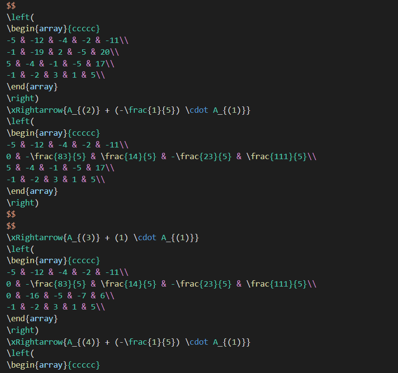

# What is this?

This script allows you prerender some operations on matrixes (triangle and canonical) in .tex.

# How to use?

First of all, install Node.js, then

```
git clone https://github.com/vladgovor77771/latex_matrixes
cd latex_matrixes
cp input.example.js input.js // or create input.js and copy all content
// modify input.js
node index.js
```

# Input data

It is allowed to pass fractions.

```js
module.exports = {
  operation: "canonical",
  // operation: "triangle",
  maxCountOnLine: 2, // how many matrixes to render on each line
  matrix: [
    [-5, -12, -4, -2, -11],
    [-1, -19, 2, -5, 20],
    [5, -4, -1, -5, 17],
    [-1, -2, 3, 1, 5],
  ],
};
```

# Example of result




Example of .tex you can find in `./example` folder in this repo.

# Contribution

All bugs can be passed to Github issues. If you want to add a feature, create merge request.

# Todo

- transpose
- inverse
- determinant
- LU decomposition
- perform parameters in matrix elements
- perform several transformations in `\substack{}`
